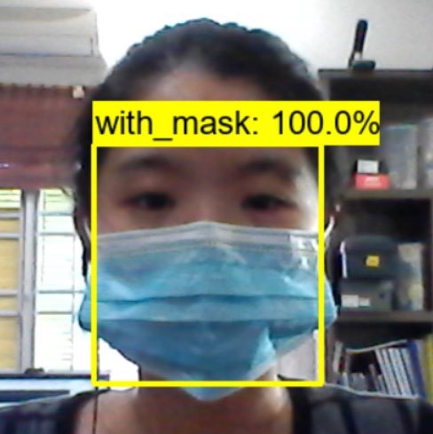
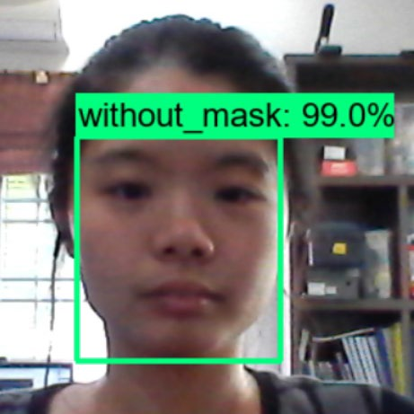
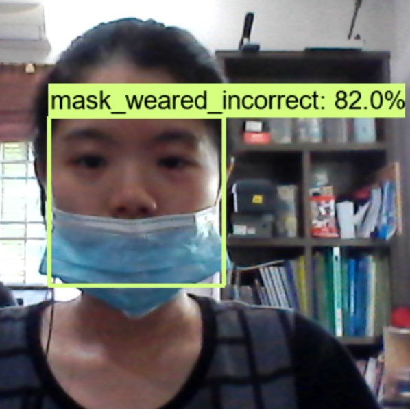

# Face Mask Detector
 AI model that detects if a person is wearing a mask on live video feed

 ## Quick Snaps
 

  <table>
   <tr>
     <td></td>
     <td></td>
     <td></td>
   </tr>
  </table>
 

 # What I learned
 * Transfer Learning using models provided by Tensorflow
 * Letting AI models perform detection on live video feed
  
  
# Generation Google Scholarships - program extension for Australia and New Zealand Event
3-minute lightning video about the project

  

Selected as one of the winners :tada:  

## References
Renotte, N. (2020). Real time face mask detection with Tensorflow and Python. YouTube. https://youtu.be/IOI0o3Cxv9Q?feature=shared
